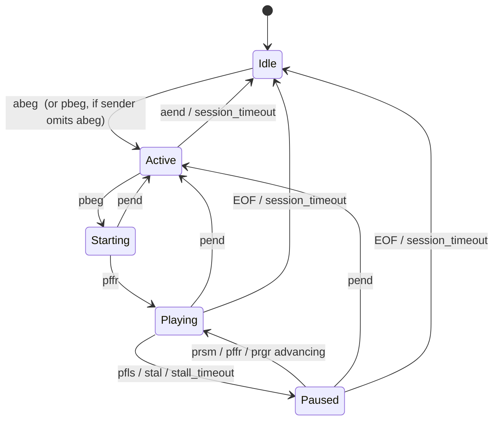

# LP Frame — Design Document

**Status:** Draft, awaiting sign-off
**Repo:** `tunlezah/AudioView`
**Product:** A vinyl-LP-sized wall/shelf display that shows the cover art of whatever is currently AirPlaying to it, and nothing else.

---

## 1. Summary

LP Frame is a single-purpose appliance. A Raspberry Pi runs an AirPlay 2 receiver, feeds audio to a USB DAC, raises a GPIO line to wake an amplifier, and renders the current track's album art full-bleed on a square panel with GPU crossfades. There is no UI, no text, no chrome. When music stops, the screen fades to black and the panel is powered down.

The one non-obvious feature is **artwork enrichment**: AirPlay delivers cover art at roughly 500×500, which looks soft on a 1920×1920 panel. We look the album up against public catalogues, fetch art at up to 3000×3000, verify it actually matches, and hot-swap it in behind a short crossfade.

### Design principles

1. **The AirPlay art is the source of truth.** Enrichment is best-effort decoration. Network down, API down, no match — the device behaves identically minus sharpness.
2. **The renderer is dumb.** It has no notion of AirPlay, tracks, or the network. It receives "display this file" and "go to sleep". Every policy decision lives in `artd`.
3. **Idle costs nothing.** A static image means zero page flips, zero GPU work. A dark screen means the CRTC is off.
4. **Everything runs on a laptop.** No component requires a Pi to build, run, or test.

### Terminology

| Term | Meaning |
|---|---|
| *pipe* | The shairport-sync metadata FIFO, default `/tmp/shairport-sync-metadata` |
| *item* | One XML-framed metadata record on the pipe |
| *bundle* | A group of `core` items delimited by `mdst`/`mden`, describing one track |
| *revision* | Monotonic counter identifying a distinct artwork image to display |
| *enrichment* | Replacing AirPlay art with a higher-resolution copy from a public catalogue |

---

## 2. Hardware and OS decisions

### 2.1 Target hardware

| | Primary | Fallback | Development |
|---|---|---|---|
| Board | Raspberry Pi 5 (4GB+) | Raspberry Pi 4B (2GB+) | any x86_64 Linux |
| Panel | 1920×1920 square via HDMI→eDP board | same | Waveshare 4" 720×720 HDMI, or an SDL2 window |
| Audio | USB Audio Class 2 DAC (e.g. FiiO KA-series) | same | any ALSA device / `null` |
| Amp trigger | 1× GPIO → optocoupler → 12V trigger | same | stub GPIO backend |
| Network | Ethernet preferred, Wi-Fi fallback | same | whatever |

### 2.2 OS: Raspberry Pi OS Lite 64-bit — *not* Alpine

**Recommendation: Raspberry Pi OS Lite (Debian trixie base), 64-bit.**

The image-size argument for Alpine is real but small — we are talking a few hundred MB on a card that will be 16GB minimum. What we would pay for it is significant:

- **Mesa v3d/vc4.** Raspberry Pi ships and tests a specific Mesa against a specific kernel and firmware. On the Pi 5 the BCM2712 display pipeline (`vc4` driver, "MOP"/"MOPLET" blocks) is still seeing active upstream work; being on the vendor's tested combination is worth a lot when the entire product is one GLES surface on a KMS plane. Alpine's Mesa is fine on desktop GPUs and is not a tested configuration here.
- **Firmware and device tree.** `dtoverlay=vc4-kms-v3d`, custom HDMI timings for a non-standard 1920×1920 mode, `cma=` sizing, and the Pi 5's RP1 pin controller all assume Pi OS's `config.txt` / `firmware` tooling. Reproducing this on Alpine is possible and is a maintenance liability forever.
- **musl vs glibc.** shairport-sync with AirPlay 2 pulls in libplist, libsodium, libgcrypt, and ffmpeg. All build on musl, none are *tested* on musl by their maintainers. This is exactly the class of bug that shows up as intermittent audio dropouts three weeks in.
- **Tooling.** `libgpiod` v2, `alsa-utils`, `raspi-config`'s overlayfs toggle, `rpi-eeprom`, `pinctrl`, `vcgencmd` — all first-class on Pi OS.

We recover most of Alpine's benefit through configuration rather than distro choice: Lite has no desktop, we mask what we don't need, we use overlayfs for a read-only root, and we set journald to volatile storage. Expect a ~1.2GB installed footprint and ~15s boot to first frame.

**Base release:** trixie-based Raspberry Pi OS Lite (64-bit). Bookworm works and is a documented fallback; the installer detects and adapts.

### 2.3 shairport-sync: build from source

Distro packages historically ship without `--with-airplay-2` because nqptp is a separate daemon. We pin and build both from source, verified by `shairport-sync -V` reporting `AirPlay2`. The installer checks for a distro package with AP2 already compiled in and uses it if present, so this cost disappears when Debian catches up.

---

## 3. Architecture

```
                    ┌───────────────────────────────────────────────┐
   iPhone / Mac     │  Raspberry Pi                                 │
   ──AirPlay 2──────┼─▶ nqptp (PTP clock, root, udp/319+320)        │
                    │        │                                      │
                    │        ▼                                      │
                    │   shairport-sync ──ALSA──▶ USB DAC ──▶ Amp    │
                    │        │                                ▲     │
                    │        │ metadata FIFO                  │     │
                    │        ▼                            12V trig  │
                    │   ┌─────────┐                            │    │
                    │   │  artd   │──libgpiod──────────────────┘    │
                    │   │         │                                 │
                    │   │ parser  │◀──HTTPS──▶ iTunes Search API    │
                    │   │ state   │            MusicBrainz + CAA    │
                    │   │ enrich  │                                 │
                    │   │ power   │──▶ /var/lib/lpframe/cache/      │
                    │   └────┬────┘──▶ /run/lpframe/art/  (tmpfs)   │
                    │        │                                      │
                    │   NDJSON over AF_UNIX                         │
                    │   /run/lpframe/artd.sock                      │
                    │        │                                      │
                    │        ▼                                      │
                    │   lprender ──KMS/DRM + GBM + EGL + GLES3──▶ 🖼 │
                    └───────────────────────────────────────────────┘
```

### 3.1 Why this split

`artd` and `lprender` are separate processes because they have incompatible failure and latency profiles. The renderer must never block: a stalled HTTPS request or a slow SD-card write cannot be allowed to drop a frame. Conversely, a renderer crash (GPU driver wedge, hotplug race) must not lose session state or leave the amp powered on. Separate processes with a supervised socket between them gives us independent restart, and lets us run either one alone during development.

They are not separate because of language boundaries — both are Rust.

### 3.2 Language: Rust for both

A single Cargo workspace, one toolchain, one cross-compilation story, shared types for the IPC schema so the protocol cannot drift between the two ends.

- `artd`: `tokio` async runtime, `reqwest` (rustls) for HTTP, `serde`, `image`/`zune-jpeg` for decode, `rusqlite` (bundled) for the cache index, `gpiocdev` for libgpiod v2 character-device GPIO.
- `lprender`: `drm-rs`, `gbm`, `khronos-egl`, `glow` for GLES3, `sdl2` behind a feature flag for the dev backend. No async runtime — a hand-rolled `epoll` loop, because frame pacing wants explicit control.

C was considered for `lprender`. The DRM/GBM/EGL crates are thin bindings over the same libraries, so we lose nothing, and we gain the shared protocol crate.

### 3.3 Repository layout

```
AudioView/
├── Cargo.toml                  # workspace
├── crates/
│   ├── lpframe-proto/          # IPC message types (serde), shared by both ends
│   ├── lpframe-config/         # TOML config schema + loader + validation
│   ├── spmeta/                 # shairport-sync metadata pipe parser (pure lib)
│   ├── artd/                   # metadata + artwork + power daemon
│   ├── lprender/               # KMS/DRM renderer (+ SDL2 dev backend)
│   └── lpcapture/              # fixture capture / replay tool
├── fixtures/
│   ├── sessions/               # captured pipe byte streams + golden event logs
│   └── art/                    # content-addressed PICT payloads (git-lfs)
├── systemd/
├── provisioning/
│   ├── install.sh
│   └── pi-gen/
├── docs/
│   ├── DESIGN.md               # this file
│   └── BUILD.md                # full OS build + install guide (written last)
└── Makefile
```

---

## 4. `spmeta` — the metadata parser

### 4.1 Wire format

shairport-sync writes a stream of XML-framed items to the FIFO. Verified against `shairport-sync-metadata-reader`, whose parser scans for:

```
<item><type>%8x</type><code>%8x</code><length>%zu</length>
```

Zero-length item:

```
<item><type>73736e63</type><code>70626567</code><length>0</length></item>
```

Item with payload:

```
<item><type>636f7265</type><code>6d696e6d</code><length>11</length>
<data encoding="base64">
SGVsbG8gV29ybGQ=</data></item>
```

`type` and `code` are FourCCs rendered as 8 hex digits. `length` is the *decoded* byte length. The base64 payload is line-wrapped. This is a byte stream, not a document — there is no root element, and a reader must be resilient to starting mid-item (which happens on every reconnect).

### 4.2 Parser design

A `#![forbid(unsafe_code)]` pull parser over a growable byte buffer, driven by `feed(&[u8]) -> impl Iterator<Item = Result<MetaItem>>`. No allocation per item beyond the payload itself.

Recovery rule: on any framing error, scan forward for the next literal `<item>` and resume, emitting a `ParseError` event so we can count them in metrics. Starting mid-stream therefore costs at most one dropped item.

Hard limits, because this is parsing attacker-adjacent input (anything on the LAN can AirPlay to us): `length` is rejected above `max_item_bytes` (default 8 MiB, covering any plausible cover art), the reassembly buffer is capped, and base64 decode is streaming rather than buffered-then-decoded.

```rust
pub struct MetaItem {
    pub kind: FourCc,          // b"ssnc" | b"core"
    pub code: FourCc,
    pub payload: Bytes,        // empty for zero-length items
}
```

A second layer, `spmeta::Decoder`, turns `MetaItem`s into typed events, decoding DMAP payloads by code:

```rust
pub enum MetaEvent {
    ActiveBegin, ActiveEnd,                 // abeg / aend
    PlayBegin, PlayEnd, PlayFlush,          // pbeg / pend / pfls
    PlayResume, FirstFrame,                 // prsm / pffr
    BundleStart, BundleEnd,                 // mdst / mden
    PictureStart, PictureEnd,               // pcst / pcen
    Picture(Bytes),                         // PICT (may be zero-length = "no art")
    Progress { start: u32, current: u32, end: u32 },   // prgr
    Volume { airplay_db: f32, .. },         // pvol
    ClientName(String), UserAgent(String),  // snam / snua
    Stall,                                  // stal
    Core(CoreField),                        // asal/asar/minm/…
    Unknown { kind: FourCc, code: FourCc, len: usize },
}
```

### 4.3 Codes we consume

**`ssnc` (shairport-sync itself)**

| Code | Meaning | Used for |
|---|---|---|
| `abeg` / `aend` | Active mode entered / exited | Amp trigger, session lifecycle |
| `pbeg` / `pend` | Play stream begin / end | Display wake / sleep |
| `pffr` | First frame received and validly timed | Confirms audio is actually flowing |
| `pfls` | Play stream flush | Seek or pause |
| `prsm` | Play stream resume | Resume |
| `mdst` / `mden` | Metadata bundle start / end | Atomic track commit |
| `pcst` / `pcen` | Picture transmission start / end | Artwork framing |
| `PICT` | Cover art payload (JPEG or PNG) | The whole point |
| `prgr` | Progress, RTP timestamps | Position, liveness |
| `pvol` | Volume in dB | Diagnostics only |
| `snam` / `snua` | Client device name / user agent | Diagnostics, status page |
| `stal` | Metadata reception stall | Watchdog input |
| `svip` / `clip` | Server / client IP | Diagnostics |
| `conn` / `disc` | AirPlay 2 client connect / disconnect | Session lifecycle corroboration |

**`core` (DMAP/DAAP, per track)**

`minm` title · `asar` artist · `asal` album · `asaa` album artist · `asgn` genre · `ascp` composer · `astm` duration (ms) · `astn` track number · `mper` persistent track ID · `ascm` comment · `asdt` description

**Deliberately ignored:** `copl` (RTSP plist), `cmod`, `cdid`, `cmac`, `daid`, `acre`, `dapo`, `sdsc`, `odsc`, `phb0`, `phbt`, `styp`. Some are remote-control plumbing we do not need (we are a receiver, not a controller); others are undocumented. `paus` / `pres` appear in newer builds and are *probably* AirPlay 2 pause/resume, but their exact semantics relative to `pfls`/`prsm` are unverified — this is precisely what the fixture captures are for, and until a real capture confirms them the state machine does not depend on them. They are logged as `Unknown`, and adding them later is a one-line change.

### 4.4 Tests

Table-driven unit tests for framing (truncated items, split base64, garbage prefix, oversized length, interleaved whitespace), plus fixture replay: feed `fixtures/sessions/*.pipe` byte-by-byte *and* in random-sized chunks, assert the emitted event sequence equals the golden `*.events.json`. Chunk-size fuzzing is not optional — the FIFO delivers arbitrary boundaries and this is where naive parsers break.

---

## 5. `artd` — metadata, artwork, and power daemon

### 5.1 Pipe consumption vs. session hooks

**Open question 1 answered: consume the pipe, do not use `run_this_before_play_begins` / `run_this_after_play_ends`.**

Reasons:

1. **We need the pipe anyway.** Track metadata and artwork only exist there. Hooks would be a *second* event source that must be reconciled with the first, and reconciling two clocks is strictly worse than reading one.
2. **Ordering.** Hook processes are forked and scheduled independently. There is no guarantee that a hook's side effect lands before or after the corresponding pipe items. With one source, ordering is the stream order, by definition.
3. **Hooks can stall audio.** With `wait_for_completion` set, shairport-sync blocks on the hook before starting playback. A slow script becomes audible latency. Without it, ordering gets worse.
4. **Resolution.** The pipe distinguishes `abeg` (session up) from `pbeg` (stream starting) from `pffr` (audio genuinely flowing). Hooks collapse this to one edge. We want `abeg` for the amp — it gives the amplifier a few hundred milliseconds to unmute before the first note — and `pffr` for the display, so we don't wake the panel on a session that never plays.

**Abrupt client disconnect** is the failure mode hooks are usually reached for, so it needs a real answer:

- **Normal case.** shairport-sync's RTSP teardown emits `pend` then `aend`. On AirPlay 2, keepalive loss takes a few seconds to tens of seconds. Handled by the state machine directly.
- **Silent case.** Sender vanishes (phone in a Faraday cage, Wi-Fi drop) and shairport-sync hasn't timed out yet. A **watchdog** covers it: in `Playing` with no pipe activity and no `prgr` for `stall_timeout` (default 15s), or on `stal`, transition to `Paused`; after `session_timeout` (default 60s), transition to `Idle`.
- **Catastrophic case.** shairport-sync itself dies or restarts. Our `read()` on the FIFO returns **EOF** the moment the last writer closes. We treat EOF as an unambiguous "writer gone" → force `Idle` → reopen the FIFO (blocking, which parks until a writer appears).

That last point is a genuine fork in the design, so to be explicit: a common trick is to hold a dummy `O_WRONLY` descriptor on the FIFO so `read()` never returns EOF and you get one uninterrupted stream. **We deliberately do not do this.** The EOF is the single most reliable signal we get that shairport-sync is gone, and trading it for a tidier read loop would leave the amp powered on and the screen lit after a crash. We take the reopen churn.

Cost of a false `Idle` is near zero: the amp-off delay is minutes, the display-off delay is minutes, and any subsequent pipe activity instantly re-wakes both.

`artd` starts *before* shairport-sync (systemd ordering) and creates the FIFO itself, because shairport-sync drops metadata written when no reader is attached — without this we lose the first bundle of every boot.

### 5.2 State machine



Notes:

- **Senders that never emit `abeg`/`aend`.** These are AirPlay-2-era codes; AirPlay 1 senders and some third-party ones skip them. `pbeg` therefore implicitly enters `Active` first. Symmetrically, `pend` with no `aend` within `session_timeout` falls through to `Idle`.
- **`Starting` exists** so we don't wake the panel for a session that connects and never plays. If `pffr` never arrives, we stay dark.
- **Metadata bundles are transactional.** `core` items between `mdst` and `mden` accumulate into a pending track; the track is committed — and a `track_changed` event emitted — only at `mden`. A bundle interrupted by `pend` is discarded. This prevents the classic flicker where artist updates one frame before title.
- **Artwork is independent of the bundle.** `PICT` typically arrives after `mden`, bracketed by `pcst`/`pcen`. A zero-length `PICT` means "this track has no art" and clears to the configured placeholder.
- **Track identity** is `mper` when present, otherwise `sha256(normalize(artist) ‖ normalize(album) ‖ normalize(title))`. Identity drives "is this actually a new track?" — repeated identical bundles (common) must not retrigger a crossfade.

### 5.3 IPC: NDJSON over a Unix socket

`SOCK_STREAM` at `/run/lpframe/artd.sock`, mode `0660`, owner `lpframe:lpframe`. One newline-delimited JSON object per message, UTF-8, no embedded newlines. Multiple concurrent clients (renderer, status page, `lpctl` debug CLI).

**Design choice: full-snapshot-on-every-change, not deltas.** Every state change publishes the complete state object with an incremented `seq`. The renderer holds no history and reconstructs nothing; it diffs the snapshot against what it is currently showing. A client that connects late, reconnects, or misses a message is immediately correct. The messages are small (a few hundred bytes) and change a handful of times per track — there is no efficiency argument for deltas here, and delta protocols are where resync bugs live.

**Server → client**

```json
{"v":1,"type":"state","seq":42,"ts":"2026-07-27T10:14:02.113Z","state":{
  "playback": "playing",
  "session": {
    "active": true,
    "client_name": "Ben's iPhone",
    "user_agent": "AirPlay/845.5.1"
  },
  "track": {
    "id": "b1946ac92492d234",
    "title": "Teardrop",
    "artist": "Massive Attack",
    "album": "Mezzanine",
    "album_artist": "Massive Attack",
    "genre": "Electronica",
    "duration_ms": 330000,
    "track_number": 3
  },
  "artwork": {
    "revision": 7,
    "path": "/run/lpframe/art/0007-4f3a9c1e.jpg",
    "sha256": "4f3a9c1e…",
    "width": 3000,
    "height": 3000,
    "source": "itunes",
    "is_upgrade": true,
    "placeholder": false
  },
  "progress": {"position_ms": 12480, "duration_ms": 330000},
  "volume": {"airplay_db": -14.5, "muted": false},
  "power": {"amp": true, "display": "on"}
}}
```

| Field | Notes |
|---|---|
| `playback` | `idle` \| `active` \| `starting` \| `playing` \| `paused` |
| `track` | `null` when unknown. Any string field may be absent. |
| `artwork.revision` | Monotonic. **The renderer's sole trigger for a crossfade.** |
| `artwork.path` | File on tmpfs. Bytes never traverse the socket. |
| `artwork.is_upgrade` | `true` when this replaces the *same* album's art with a higher-resolution copy. The renderer uses `enrichment_crossfade_ms` (250ms) rather than the full 600ms, because it is the same picture getting sharper, not a new record. |
| `artwork.source` | `airplay` \| `itunes` \| `coverartarchive` \| `cache` \| `placeholder` |
| `power.display` | `on` \| `ambient` \| `off` — a *request*; the renderer owns the transition. |

Also emitted: `{"type":"hello","v":1,"server":"artd","version":"0.1.0"}` on connect (immediately followed by a full `state`), `{"type":"pong"}`, and `{"type":"log","level":"warn","msg":"…"}` for surfacing enrichment failures to the status page.

**Client → server**

```json
{"v":1,"type":"hello","client":"lprender","proto":1}
{"v":1,"type":"get_state"}
{"v":1,"type":"ping"}
{"v":1,"type":"set_display","value":"on"}        // manual override, expires after 5 min
{"v":1,"type":"inject_artwork","path":"/tmp/x.jpg"}   // --debug builds only
```

Version negotiation: `v` is the envelope version. A client sending an unknown `proto` gets a `hello` with the server's supported range and the connection stays open at the highest mutually supported version. Unknown message types and unknown fields are ignored, not fatal — this is how we add a second metadata source later without a flag day.

**Artwork file lifecycle.** Images are written to `/run/lpframe/art/` (tmpfs) as `NNNN-<sha8>.jpg`, written to a temp name and `rename()`d so a reader never sees a partial file. `artd` retains the last 4 revisions and unlinks older ones after a 60-second grace period, so the renderer can never have a path pulled out from under it mid-decode.

### 5.4 Artwork enrichment

**Open question 3 answered: both gates, in sequence — text match selects the candidate, perceptual match authorises the swap.**

Text matching alone gets "Greatest Hits" wrong in ways that are viscerally annoying on a wall. Histogram matching alone rejects legitimate regional cover variants and different masters, which is the common case for exactly the albums where a high-res upgrade matters most. Neither is sufficient; together they are cheap and strict.

```
track committed (mden)
        │
        ▼
  display AirPlay art immediately          ◀── always, unconditionally, revision++
        │
        ▼
  cache lookup: key = sha256(norm(artist) ‖ norm(album))
        │
        ├── hit ──▶ verify file, display it (source=cache) ──▶ done
        ├── negative-cache hit (< 7 days) ──▶ done, no network
        │
        ▼
  rate limiter (token bucket, 15/min iTunes) + single-flight per key
        │
        ▼
  ① iTunes Search: entity=album, term="artist album", limit=10, country=<config>
        │
        ▼
  ② TEXT GATE
     normalise: lowercase, strip diacritics, strip "(Deluxe Edition)",
                "- Remastered 2011", "[Explicit]", collapse punctuation
     Jaro-Winkler: artist ≥ 0.90  AND  album ≥ 0.85
        │  fail → try MusicBrainz release-group → Cover Art Archive front-1200
        │         (1 req/s, UA with contact string) → same gate → else give up
        ▼
  ③ FETCH: rewrite artworkUrl100's "100x100bb.jpg" → "3000x3000bb.jpg"
     Apple serves the largest available if the request exceeds it; 3000×3000 is
     the documented ceiling. Fall back 1500 → 1000 → 600 on 404.
        │
        ▼
  ④ SIZE GATE: candidate's min dimension ≥ 1.5 × AirPlay art's min dimension.
     A 600×600 "upgrade" over 500×500 art is not worth a swap.
        │
        ▼
  ⑤ PERCEPTUAL GATE  (both must pass)
     downscale both to 32×32, convert to OKLab
     (a) dHash Hamming distance ≤ 12 / 64
     (b) dominant-colour histogram cosine similarity ≥ 0.85
     BYPASS: skip ⑤ if text scores are near-exact (artist ≥ 0.97 AND album ≥ 0.97)
             — covers legitimate alternate cover art for an unambiguous album
        │
        ▼
  ⑥ SWAP: write to cache + tmpfs, revision++, is_upgrade=true
     renderer crossfades over 250ms
```

**Strictness is configurable** — `enrichment.strictness = "off" | "text_only" | "text_and_visual" | "strict"`, default `text_and_visual`. `strict` removes the near-exact bypass in ⑤. This is the knob to reach for if wrong-album swaps ever show up in real use.

**Failure handling.** Any network error keeps the AirPlay art and schedules a retry with exponential backoff, capped at 3 attempts per track, abandoned on track change. HTTP 429 honours `Retry-After` and pauses the whole bucket. Offline is not an error state — it is the normal state of a device on a flaky Wi-Fi network, and it must be silent.

**Rate limiting.** iTunes fair-use is ~20 req/min per IP; we budget 15. MusicBrainz requires ≤1 req/s and a User-Agent carrying a contact address, taken from config. Enrichment runs on a bounded worker pool (2 tasks) so it can never starve the pipe reader.

**Privacy.** Enrichment transmits artist and album strings to Apple and/or MusicBrainz. `enrichment.enabled` (default `true`) turns it off entirely; this is documented prominently in the config file, not buried.

**Cache.** `/var/lib/lpframe/cache/<aa>/<sha256>.jpg` with an SQLite index (`key, sha256, bytes, width, height, source, created_at, last_access`). LRU eviction to `cache.max_bytes` (default 2 GiB), swept on startup and hourly. Negative entries carry a 7-day TTL. SQLite rather than a bare directory because eviction needs an atomic, crash-safe index, and rebuilding LRU order from `stat()` after a power cut is exactly the kind of thing that quietly stops working.

### 5.5 Power management

**Amplifier trigger.** One GPIO line via libgpiod v2 character device.

Pi 5 moved the 40-pin header to the RP1 pin controller and the `gpiochipN` numbering has shifted between kernel releases. **Resolve the chip by label, never by index** — `pinctrl-rp1` on Pi 5, `pinctrl-bcm2835` on Pi 4. Config accepts `chip = "auto"` (probe for a header controller) or an explicit label.

```toml
[power.amp]
gpio_chip   = "auto"
gpio_line   = 17
active_low  = false
pulse_ms    = 0        # 0 = hold level while on; >0 = momentary pulse for toggle-style amps
on_event    = "session_begin"   # abeg — early, so the amp unmutes before the first note
off_delay   = "10m"             # after entering Idle
```

**Hardware requirement, documented in the build guide:** the optocoupler input must have a pull-down (or pull-up, if `active_low`) resistor to a safe state. When `artd` exits, the kernel releases the GPIO request and the line reverts to its default — without an external resistor, a crash could leave the amplifier powered indefinitely. `artd` also drives the line off in its `ExecStop` and on `SIGTERM`, but that only covers clean shutdown; the resistor covers the rest.

Both amp and display transitions are debounced (default 2s) so a track skip that briefly passes through `Idle` cannot chatter a relay.

**Display power** is requested by `artd` and executed by `lprender`:

| Idle duration | `power.display` | Renderer behaviour |
|---|---|---|
| 0 | `on` | Artwork at full brightness |
| > `ambient_after` (default off) | `ambient` | Blurred, dimmed last artwork |
| > `blank_after` (default 5m) | `off` | Fade to black over 1s, then CRTC `ACTIVE=0` |

Wake is instant on `abeg`/`pbeg`: CRTC on, fade in from black.

---

## 6. `lprender` — the renderer

### 6.1 DRM atomic vs. legacy

**Open question 4 answered: atomic modesetting.**

The framing of "atomic vs. legacy" is slightly misleading on this stack — `vc4` is an atomic driver, and the legacy ioctls are emulated on top of it by `drm_atomic_helper`. Choosing legacy does not get us a simpler path to the hardware; it gets us a compatibility shim over the same path, with less control. Concretely, atomic gives us:

- **`TEST_ONLY` commits.** We can validate a modeset before applying it. On hotplug into an unknown panel this is the difference between a clean fallback and a black screen.
- **A single commit** for CRTC + plane + framebuffer, so mode changes are glitch-free.
- **`CRTC.ACTIVE = 0`** for true panel-off. This is a cleaner and more reliable way to reach <2W than legacy connector-level DPMS on the vc4 path.
- **Non-blocking commits with page-flip events** on the DRM fd, which is what our epoll loop is built around.

**Gamma LUT: we do not use it.** Fading to black via the CRTC gamma ramp is the traditional trick, but gamma support across `vc4` on BCM2711 and BCM2712 is inconsistent, and a fade that silently no-ops on one board and works on the other is a bad dependency for the single most visible transition in the product. Instead, **fades are a `uniform float uGlobalFade` multiply in the fragment shader.** This is exact, identical on the Pi and on the SDL2 dev backend, and unit-testable with golden images. Only once the fade reaches zero do we issue the atomic `ACTIVE=0` commit.

One known Pi 5 issue avoided by construction: `DRM_MODE_PAGE_FLIP_ASYNC` is broken on the Pi 5's v3d/vc4 stack (raspberrypi/linux#5828). We only ever issue vsync-synchronised non-blocking flips, so this never bites us.

### 6.2 Initialisation

1. Enumerate `/dev/dri/card*`, select by `drmGetVersion().name == "vc4"` (dev backend: `--card` override). Never hardcode `card0` — the numbering moves when the v3d render node enumerates first.
2. `DRM_CLIENT_CAP_ATOMIC` + `DRM_CLIENT_CAP_UNIVERSAL_PLANES`.
3. First connected connector (or `display.connector` from config); its preferred mode, or `display.mode` if overridden — needed for a non-standard 1920×1920 panel whose EDID may be wrong or absent.
4. GBM device + surface, `GBM_FORMAT_XRGB8888`, `SCANOUT | RENDERING`.
5. EGL via `EGL_PLATFORM_GBM_KHR`, GLES 3.0 context, `eglSwapInterval(1)`.
6. Initial atomic commit: `ALLOW_MODESET`, CRTC active, primary plane full-screen, first framebuffer black.

**DRM master and VT-less boot.** `lprender` runs as a systemd service after `multi-user.target` with `getty@tty1` masked. `fbcon` is not a DRM master, so becoming master is uncontended in practice; we still retry `drmSetMaster` with backoff on `EACCES` (covers a stray `plymouth` or a leftover session). Kernel cmdline gets `logo.nologo consoleblank=0 vt.global_cursor_default=0`, and `config.txt` gets `disable_splash=1`, so nothing else ever draws to the panel. Because there is no VT switching, we do not need to handle `DROP_MASTER`/`SET_MASTER` cycles — but the handler is implemented anyway and is what makes the renderer restartable without a reboot.

**Hotplug.** A `libudev` monitor on the `drm` subsystem, its fd in the epoll set. On a `change` event: re-probe the connector. Disconnected → tear down GBM/EGL, release master, and idle in a reconnect loop. Reconnected with a different mode → full re-init. This is the code path that turns a panel that was merely unplugged into a device that recovers, instead of one that needs a power cycle.

### 6.3 Render pipeline

**Square, resolution-agnostic.** Let `s = min(mode.hdisplay, mode.vdisplay)`. The whole framebuffer clears to black; the viewport is an `s × s` square centred in it. A 1:1 panel is full-bleed; anything else letterboxes or pillarboxes. Rotation (`display.rotation = 0|90|180|270`) is applied as a rotation in the vertex shader rather than via the plane `rotation` property — the property is not guaranteed present on every plane, and the shader path is identical on the dev backend.

**Aspect handling within the square.** Cover art is nominally square but not always. `render.fit = "cover" | "contain"`, default `cover` — crop to fill, because a full-bleed LP sleeve is the entire point.

**Texture path.** Decode happens on a worker thread; the render thread never touches libjpeg.

1. `artd` publishes a new `artwork.revision`.
2. Worker decodes, and downscales on the CPU to `min(3000, GL_MAX_TEXTURE_SIZE, 2 × s)` — no value in a 3000² texture on a 720² panel, and it costs memory we care about.
3. Upload via a **pixel buffer object** (GLES3), then `glGenerateMipmap`. Mipmaps matter: minifying 3000² to 1920² without them aliases visibly on fine label text.
4. `glFenceSync` after upload; the render thread polls with `glClientWaitSync(0)` once per frame.
5. **The crossfade does not begin until the fence signals.** The new image is therefore always fully resident before the first blended frame — which is how we guarantee no dropped frames rather than hoping.

Memory: two 1920² RGBA textures with mipmaps ≈ 40 MB. Comfortable on a Pi 5. On a Pi 4 this comes out of CMA, so the build guide sets `cma=256M` minimum.

**Crossfade.**

```glsl
uniform sampler2D uPrev, uNext;
uniform float uMix;         // 0→1, cubic ease-in-out
uniform float uGlobalFade;  // 1 = visible, 0 = black
void main() {
    vec3 c = mix(texture(uPrev, vUv).rgb, texture(uNext, vUv).rgb, uMix);
    fragColor = vec4(c * uGlobalFade, 1.0);
}
```

600ms default, cubic ease-in-out, 60fps, driven by the monotonic clock rather than a frame counter so a dropped frame shortens the fade instead of stretching it.

**Frame pacing — render on demand.** This is the single most important power decision in the renderer. A static image means **zero page flips**: the scanout hardware keeps displaying the last framebuffer indefinitely, at no CPU or GPU cost. The event loop is an `epoll` over `{drm_fd, artd_socket, udev_monitor, timerfd}` and blocks indefinitely when nothing is animating. We drive at vsync only during a crossfade, a fade to/from black, Ken Burns, or ambient mode. A naive 60fps loop would cost several watts continuously for a device that shows the same picture for four minutes at a time.

**Ken Burns** (`render.ken_burns = false` by default): scale 1.00 → 1.04 over `render.ken_burns_period` (default 180s) with slight drift, cubic-eased at the turnarounds. Default off because it forces continuous rendering and therefore continuous power draw — the user should opt into that trade knowingly.

**Ambient mode** (`render.ambient = false` by default): the last artwork, heavily blurred and dimmed to ~12%. Implemented as a dual-Kawase downsample/upsample chain (roughly 4 half-resolution passes) rather than a true separable Gaussian, which would be far more expensive at 1920² on a VideoCore. Refreshed at 1–5 fps since nothing moves.

### 6.4 Development and test backends

Selected by Cargo feature, chosen at runtime by `--backend`:

- `backend-drm` (default) — the real thing.
- `backend-sdl2` — an SDL2 window with a GLES3 context. Same GL code, same shaders, same state machine, same socket client. Fake DPMS is a window title change plus a black clear. This is how the renderer is developed without a Pi on the desk.
- `backend-headless` — EGL surfaceless/pbuffer, renders to an FBO, dumps PNGs. Used by CI: run a crossfade, dump frames at t = 0, 0.25, 0.5, 0.75, 1.0, compare against golden images with a small perceptual tolerance. Shader regressions get caught without hardware.

Standalone mode for all three: `lprender --slideshow ./pictures --interval 5s` runs the full render path with no `artd` at all, which is milestone 3's deliverable and stays useful forever as a smoke test.

---

## 7. Configuration

Single TOML file, `/etc/lpframe/config.toml`, read by both daemons. Validated on load; a malformed config fails the service loudly rather than falling back to defaults silently. `SIGHUP` reloads everything except display mode and GPIO line.

```toml
[device]
name = "LP Frame"              # AirPlay advertised name
timezone = "Europe/London"

[audio]
alsa_device = "hw:CARD=KA11,DEV=0"
mixer = "PCM"                  # "" to disable hardware volume

[display]
connector = "auto"             # or "HDMI-A-1"
mode = "auto"                  # or "1920x1920@60"
rotation = 0                   # 0 | 90 | 180 | 270
card = "auto"

[render]
fit = "cover"                  # cover | contain
crossfade_ms = 600
enrichment_crossfade_ms = 250
ken_burns = false
ken_burns_period = "180s"
ambient = false
ambient_dim = 0.12
placeholder = "/usr/share/lpframe/placeholder.png"

[enrichment]
enabled = true
strictness = "text_and_visual" # off | text_only | text_and_visual | strict
sources = ["itunes", "musicbrainz"]
itunes_country = "GB"
max_dimension = 3000
contact = "you@example.com"    # required by MusicBrainz; unused if only itunes
rate_limit_per_min = 15

[cache]
dir = "/var/lib/lpframe/cache"
max_bytes = "2GiB"
negative_ttl = "7d"

[power.amp]
enabled = true
gpio_chip = "auto"
gpio_line = 17
active_low = false
pulse_ms = 0
on_event = "session_begin"     # session_begin | play_begin
off_delay = "10m"
debounce = "2s"

[power.display]
blank_after = "5m"
ambient_after = "off"          # or e.g. "30s"
fade_out_ms = 1000

[timeouts]
stall = "15s"
session = "60s"

[ipc]
socket = "/run/lpframe/artd.sock"

[logging]
level = "info"
status_page = false            # bind 127.0.0.1:8730 when true
```

---

## 8. System integration

### 8.1 Units and ordering

| Unit | Ordering | Notes |
|---|---|---|
| `nqptp.service` | `After=network.target` | Root; binds UDP 319/320 |
| `lpframe-artd.service` | `After=network-online.target`, **`Before=shairport-sync.service`** | Creates the FIFO and attaches before any metadata can be written |
| `shairport-sync.service` | `After=nqptp.service lpframe-artd.service`, `Wants=` both | |
| `lpframe-lprender.service` | `After=lpframe-artd.service multi-user.target` | |

All `Restart=always`, `RestartSec=2`, with `StartLimitIntervalSec=0` so a genuinely broken dependency doesn't permanently wedge the appliance.

The `Before=shairport-sync` ordering is the subtle one and is worth calling out: shairport-sync discards metadata written while no reader is attached to the FIFO. Getting this backwards loses the first metadata bundle of every boot, which presents as "the first track after power-on has no art" — an intermittent bug that is very annoying to diagnose after the fact.

`artd` and `lprender` do **not** `Requires=` each other. Either can restart independently; the renderer reconnects to the socket with backoff and receives a full state snapshot on reconnect, which is precisely why the protocol is snapshot-based.

### 8.2 Users and hardening

A `lpframe` system user in groups `video`, `render`, `gpio`, `audio`.

```ini
# lpframe-artd.service
User=lpframe
NoNewPrivileges=yes
ProtectSystem=strict
ProtectHome=yes
PrivateTmp=no                  # needs the real /tmp for the metadata FIFO
ReadWritePaths=/var/lib/lpframe /run/lpframe
DeviceAllow=/dev/gpiochip0 rw
RestrictAddressFamilies=AF_UNIX AF_INET AF_INET6
MemoryMax=512M
```

```ini
# lpframe-lprender.service
User=lpframe
SupplementaryGroups=video render
DeviceAllow=char-drm rw
NoNewPrivileges=yes
ProtectSystem=strict
ProtectHome=yes
RestrictAddressFamilies=AF_UNIX
```

### 8.3 SD-card longevity

- **Overlayfs root** (`raspi-config` → Performance → Overlay File System) for production. `/var/lib/lpframe` moves to a small dedicated writable partition so the artwork cache survives reboots; if that is skipped, the cache becomes RAM-only and simply re-fetches, which is a legitimate configuration.
- `journald` `Storage=volatile`, `RuntimeMaxUse=32M`.
- `logrotate` for anything on disk; `noatime` mount options.
- Helper scripts `lpframe-rw` / `lpframe-ro` to toggle the overlay for maintenance.

### 8.4 Status page (optional, default off)

When `logging.status_page = true`, `artd` binds `127.0.0.1:8730` and serves one page: current state, last 50 events, enrichment hits/misses/rejections with scores, cache size, GPIO state. No controls, no auth, loopback only. Reachable over SSH port-forward. This exists to debug enrichment rejections in the field, which is otherwise guesswork.

---

## 9. Testing

| Layer | Approach |
|---|---|
| `spmeta` framing | Table-driven units: truncation, split base64, garbage prefix, oversized `length`, mid-stream start, random chunk boundaries |
| `spmeta` decode | Fixture replay → golden `*.events.json` |
| `artd` state machine | Fixture replay with a fake clock; assert transition sequence and emitted NDJSON against golden files |
| `artd` power | Fake GPIO backend recording `(timestamp, level)`; assert debounce and delays with the fake clock |
| Enrichment | `wiremock` for iTunes/MB/CAA; cassettes recorded from the real APIs via `--record`. Gate tests use a corpus of correct-match and known-wrong-match image pairs |
| Cache | LRU eviction, crash-safety (kill mid-write, assert index consistency) |
| `lprender` | Headless EGL golden images at fixed crossfade points; state-machine tests against a mock `artd` |
| Integration | `docker-compose`: real shairport-sync fed a synthetic AirPlay stream, real `artd`, headless `lprender` |

CI (GitHub Actions): x86_64 build + full test suite + clippy + rustfmt; aarch64 cross-build producing a `.deb` artifact. Golden-image tests run under `llvmpipe`.

### 9.1 `lpcapture`

The fixture tool. It sits between shairport-sync and `artd` so real sessions can be recorded from a phone and replayed forever:

```bash
# Record a live session while artd keeps working
lpcapture tee --in /tmp/shairport-sync-metadata \
              --out fixtures/sessions/apple-music-album.pipe \
              --fanout /run/lpframe/metadata-fanout

# Replay into artd
lpcapture replay fixtures/sessions/apple-music-album.pipe \
          --to /run/lpframe/metadata-fanout --speed 4x

# Regenerate golden event logs after an intentional parser change
lpcapture golden fixtures/sessions/*.pipe
```

Recordings are raw bytes — no interpretation, so the fixtures stay valid even if our parser is wrong. Timing is recorded in a sidecar so replay can reproduce real inter-item gaps (which is how we test the stall watchdog).

**Cover art makes captures enormous.** `PICT` payloads are extracted into `fixtures/art/<sha256>.jpg` and replaced in the `.pipe` file with a reference; `lpcapture replay` reassembles them. `--strip-art` substitutes a tiny synthetic JPEG for fixtures we want in git without LFS. Without this, a five-track capture is ~50 MB of base64 in the repo.

---

## 10. Implementation plan

Following the requested order. Each milestone ends with something demonstrable.

| # | Milestone | Deliverable |
|---|---|---|
| 1 | `spmeta` parser | Library + fixture tests. `lpcapture` ships here too, since we need real captures to test against. |
| 2 | `artd` core | State machine, IPC server, AirPlay-art-only path. `lpctl watch` prints live state from a phone. |
| 3 | `lprender` static/slideshow | DRM + SDL2 backends, crossfade, square letterboxing. `--slideshow` on a directory, no `artd`. |
| 4 | Integration | Renderer driven by `artd`. Play from a phone → art appears and crossfades. **This is the first end-to-end device.** |
| 5 | Enrichment | iTunes + MusicBrainz, both gates, cache, rate limiting. |
| 6 | Power management | GPIO amp trigger, display blanking, ambient mode, fade-to-black + CRTC off. |
| 7 | Provisioning | `install.sh`, `.deb`, systemd units, overlayfs, and the full `docs/BUILD.md` from clean flash to working device. |
| 8 | *Bonus* | `pi-gen` stage producing a flashable image, built in CI. |

Milestones 2 and 3 are independent and can be built in either order or in parallel.

---

## 11. Risks

| Risk | Mitigation |
|---|---|
| 1920×1920 is not a standard mode; the eDP board's EDID may be wrong or absent | `display.mode` override plus documented `config.txt` custom timings (`hdmi_timings`). Verify with `kmsprint` early — **before** committing to the panel. |
| Pi 4 CMA exhaustion with large textures | CPU downscale cap, `cma=256M`, documented. Pi 5 is unaffected. |
| Enrichment picks the wrong album | Two independent gates, `strict` mode, and a status page showing every rejection with its scores. Worst case: `enrichment.enabled = false` and the device still works. |
| iTunes Search API changes or rate-limits harder | It is a fallback-tolerant path by construction. MusicBrainz + CAA is a second source; both failing degrades to AirPlay art. |
| USB DAC clock/quirk issues (dropouts, wrong rates) | Build guide covers `snd-usb-audio` quirks, `nrpacks`, and a `speaker-test` verification step before anything else is configured. |
| AirPlay 2 needs specific ports | 7000/tcp, 319+320/udp, 5353 mDNS. Documented; installer configures the firewall if one is present. |
| shairport-sync AP2 build drift | Pin to a tagged release, record the exact `./configure` line, verify `-V` reports `AirPlay2`. |
| SD-card wear | Overlayfs root, volatile journald, cache on a separate partition. |

---

## 12. Decisions requiring sign-off

Summarising the four open questions, plus one I am adding:

1. **Pipe vs. hooks** → **Pipe only.** One event source, finer-grained states, no risk of hooks stalling audio. Abrupt disconnect handled by a stall/session watchdog plus treating FIFO EOF as "shairport-sync is gone" (§5.1).
2. **Alpine vs. Raspberry Pi OS Lite** → **Raspberry Pi OS Lite 64-bit.** The image-size saving does not pay for losing vendor-tested Mesa/KMS on a still-moving Pi 5 display stack, glibc-tested AirPlay 2 dependencies, and first-class libgpiod/ALSA/firmware tooling (§2.2).
3. **Confidence-gated vs. histogram-gated swaps** → **Both, in sequence.** Text match (Jaro-Winkler on normalised artist/album) selects the candidate; perceptual match (dHash + OKLab dominant-colour histogram) authorises the swap, with a near-exact-text bypass so legitimate alternate covers still upgrade. Strictness is configurable (§5.4).
4. **Atomic vs. legacy DRM** → **Atomic.** Legacy is a shim over the same atomic helpers on `vc4`, so it buys nothing; atomic gives `TEST_ONLY` validation, glitch-free single-commit modesets, and clean `ACTIVE=0` panel-off. **Fades are done in the fragment shader, not via gamma LUT**, because vc4 gamma support is inconsistent across BCM2711/2712 (§6.1).
5. **Added: snapshot IPC, not deltas.** Every state change sends the full state object. Late joiners and reconnects are correct by construction. Messages are small and infrequent enough that there is no efficiency case for deltas (§5.3).

### Things I would like your call on

- **Amp-on trigger point.** I have defaulted to `abeg` (session established) rather than `pbeg` (stream starting), so the amp has time to unmute before the first note. This does mean the amp powers on when someone connects and then doesn't play. Happy to switch the default to `pbeg`.
- **Default idle timings.** Screen blanks after 5 minutes, amp cuts after 10. Both configurable; these are guesses at what feels right in a living room.
- **Ambient mode default.** Currently off. It looks good but it keeps the panel lit, which works against the "<2W idle" goal.
- **Enrichment on by default.** It sends artist/album to Apple. Reasonable default for this device, but it is your device.

---

## 13. Non-goals for v1

No touch UI. No web UI beyond the optional loopback status page. No local library playback. No Spotify Connect — though `artd`'s internal boundary between "metadata source" and "state machine" is a trait, so a second source is an additive change rather than a refactor. No custom iOS app; public catalogue APIs replace Pentaton's proprietary full-resolution side channel.

---

## Appendix A — References

- shairport-sync metadata format and codes — [shairport-sync-metadata-reader](https://github.com/mikebrady/shairport-sync-metadata-reader)
- [iTunes Search API](https://developer.apple.com/library/archive/documentation/AudioVideo/Conceptual/iTuneSearchAPI/index.html) — 3000×3000 artwork ceiling, ~20 req/min fair use
- [drm/vc4 kernel documentation](https://docs.kernel.org/gpu/vc4.html)
- [BCM2712 / Pi 5 display support in vc4](https://patchew.org/linux/20241025-drm-vc4-2712-support-v2-0-35efa83c8fc0@raspberrypi.com/)
- [raspberrypi/linux#5828](https://github.com/raspberrypi/linux/issues/5828) — async page flip broken on Pi 5
- [Cover Art Archive API](https://musicbrainz.org/doc/Cover_Art_Archive/API)
